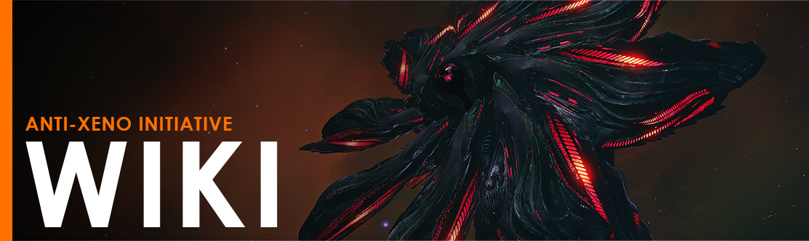

# Welcome to the Anti-Xeno Initiative Wiki Repository
This is the Official Wiki Repository for the AXI wiki. This page will act as a home for all development and changes done to the Wiki.

Wiki: https://wiki.antixenoinitiative.com/

Join us in the discussion in the [Anti-Xeno Initiative Discord](https://discord.gg/antixenoinitiative)

## How this repository works

Documents created within this repository are directly connected to pages in the AXI wiki. Pages can be created in the following formats:

- Markdown: Using Markdown formatting
- HTML: Using Basic HTML Formatting

### Page METADATA

Each page requires METADATA at the start of the file.

Markdown METADATA Example
```
---
title: README
description: 
published: true
date: 2021-06-23T11:45:38.074Z
tags: 
editor: markdown
dateCreated: 2021-06-23T11:45:35.407Z
---
```

HTML METADATA Example
```
<!--
title: Basic Combat Guide
description: The fundamental concepts of AX combat and how to fight an Interceptor.
published: true
date: 2021-06-17T04:27:27.194Z
tags: combat, thargoids, interceptors
editor: code
dateCreated: 2021-06-17T03:18:38.671Z
-->
```

### GitHub Sync

The GitHub repository will syncronize all changes (bi-directionally) with the AXI Wiki every 5 minutes. If a urgent change is needed contact Mgram#6610 on the AXI Discord.

## Translation

All Pages are based on the MASTER Pages in the root directory, these pages are all written in English. For Translations the MASTER pages are copied to the respective language folders (de/ru/etc), the pages are then translated by means of GitHub commits from our translators.
